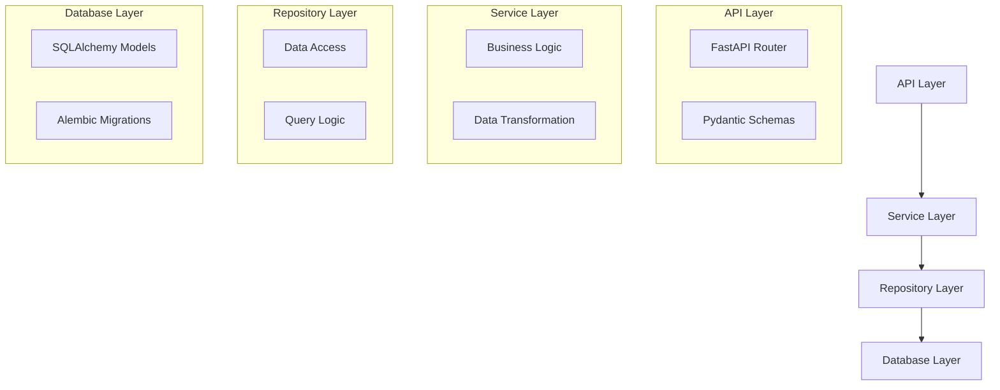
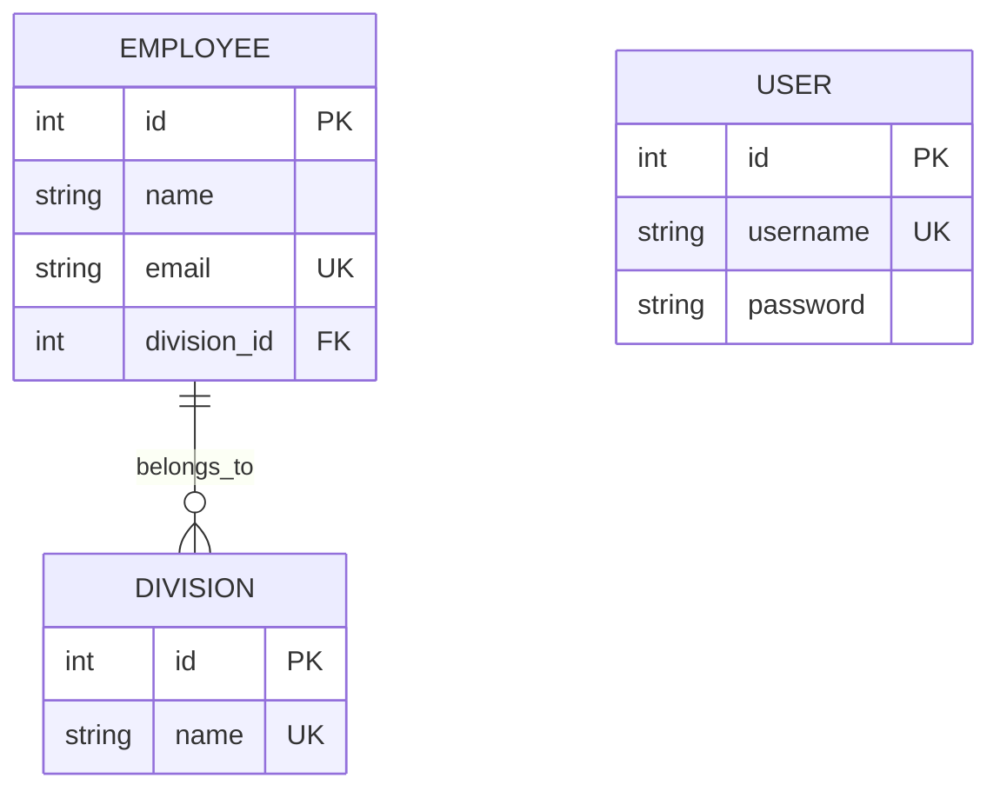
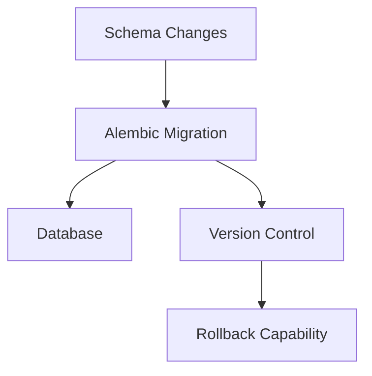

# FastAPI Employees App - Architecture and Technical Documentation

## Table of Contents
1. [Project Overview](#project-overview)
2. [Technical Architecture](#technical-architecture)
3. [Data Model](#data-model)
4. [API Design](#api-design)
5. [Project Structure](#project-structure)
6. [Development Stack](#development-stack)
7. [Database Management](#database-management)
8. [Development Practices](#development-practices)
9. [Future Considerations](#future-considerations)

## Project Overview

The FastAPI Employees App is a RESTful API service built using FastAPI, designed to manage employee data within an organization. The application implements a clean architecture pattern, separating concerns into distinct layers for better maintainability and scalability.

### Key Features
- Employee management (CRUD operations)
- Division organization
- User authentication (planned)
- RESTful API endpoints
- Database migrations support

## Technical Architecture

The application follows a layered architecture pattern, separating concerns into distinct layers:



## Data Model

The application's data model consists of three main entities:



## API Design

The API implements a RESTful architecture with versioning:

```mermaid
graph LR
    A[API v1] --> B[/api/v1/employees]
    B --> C[GET /]
    B --> D[GET /{emp_id}]
    B --> E[POST /]
    B --> F[PUT /{emp_id}]
    B --> G[DELETE /{emp_id}]
```

### Endpoints Structure
- Base URL: `/api/v1`
- Employee endpoints:
  - GET `/employees/` - List all employees
  - GET `/employees/{emp_id}` - Get specific employee
  - POST `/employees/` - Create new employee
  - PUT `/employees/{emp_id}` - Update employee
  - DELETE `/employees/{emp_id}` - Delete employee

## Project Structure

The project follows a modular structure:

```
fastapi-employees-app/
├── alembic/                 # Database migrations
├── app/                     # Application core
│   ├── api/                # API endpoints
│   │   └── v1/            # API version 1
│   ├── core/              # Core configurations
│   ├── db/                # Database components
│   │   ├── models/        # SQLAlchemy models
│   │   └── repositories/  # Data access layer
│   ├── schemas/           # Pydantic models
│   └── services/          # Business logic layer
```

## Development Stack

### Core Technologies
- **Framework**: FastAPI 0.115.x
- **Database ORM**: SQLAlchemy 2.0.x
- **Migration Tool**: Alembic 1.16.x
- **Data Validation**: Pydantic 2.11.x
- **Database**: PostgreSQL

### Development Tools
- **Package Manager**: Poetry
- **Python Version**: 3.13.4
- **Environment Management**: Poetry virtual environments

## Database Management

### Database Schema Management
The project uses Alembic for database migrations, providing:
- Version-controlled schema changes
- Automated migration generation
- Forward and rollback capabilities



## Development Practices

### Code Organization
1. **Separation of Concerns**
   - Models (Database schema)
   - Schemas (API contracts)
   - Services (Business logic)
   - Repositories (Data access)

2. **Dependency Injection**
   - Database sessions
   - Service dependencies

### Error Handling
- HTTP status codes
- Consistent error responses
- Database error handling

## Future Considerations

### Planned Enhancements
1. **Authentication & Authorization**
   - User authentication implementation
   - Role-based access control
   - JWT token support

2. **API Extensions**
   - Division management endpoints
   - User management endpoints
   - Advanced employee querying

3. **Technical Improvements**
   - Request validation
   - Response caching
   - API documentation
   - Testing suite

### Scalability Considerations
- Connection pooling
- Async database operations
- Caching strategies
- Rate limiting

## Security Considerations

### Current Implementation
- Environment-based configuration
- Database connection security
- Password hashing (planned)

### Future Security Enhancements
- API authentication
- Request rate limiting
- Input validation
- CORS policies

## Development Guidelines

### Setting Up Development Environment
1. Clone the repository
2. Create a `.env` file from `.env.example`
3. Install dependencies with Poetry
4. Run database migrations
5. Start the development server

### Code Style
- Follow PEP 8 guidelines
- Use type hints
- Document functions and classes
- Maintain consistent naming conventions

## Monitoring and Maintenance

### Logging
- SQL query logging
- Application error logging
- Performance monitoring

### Health Checks
- Database connectivity
- API endpoint health
- Service dependencies

This documentation will be updated as the project evolves and new features are implemented.
